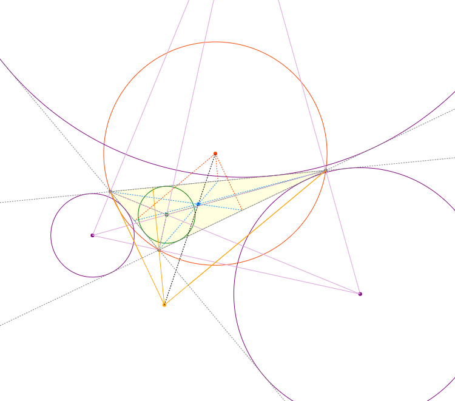
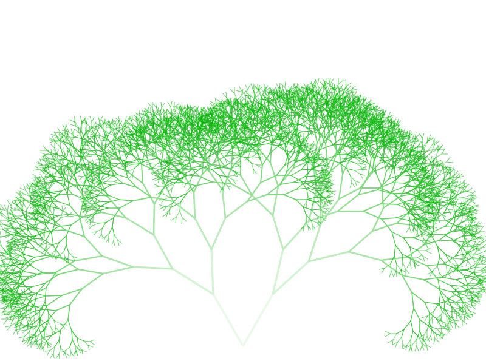

# Canvas に触ってみる

- HTML の Canvas の機能を勉強するため遊んでみました。

## 三角形の五心で遊ぶ

- [GitHub の静的ホストサイトで開く](https://azureleaf.github.io/canvas/triangle/triangle_centers.html)
- 三点を指定して三角形を描くと、その五心（外心、内心、傍心、垂心、重心）を描画します。
- 五心だけでなく、円の中心や補助線などもカラフルに描画するようUIの見やすさにはかなり注力しました。
- ソースコードが 800 行もあり、また繰り返し操作も多いのでできるだけコードが読みやすくなるように工夫しました：
  - `JSDoc`のドキュメンテーションフォーマットに沿ったコメント記述に努めました。
  - 色の指定は、定数のオブジェクトリテラルで一箇所で一括で定義し、変更に強くする。
  - `Point`オブジェクトで x 座標と y 座標を管理する（グラフィックス系のオブジェクト指向ではおなじみ）。
  - `["a", "b", "c"].forEach()`や`map()`を使ってループを簡潔に表記し可読性をたもつ。
  - 五心それぞれの描画関数の命名に規則性をもたせるなど、対称性を維持する。

## 再帰を使って複雑なフラクタル図形を短いコードで簡単に描画する

- [GitHub の静的ホストサイトで開く](https://azureleaf.github.io/canvas/fractal/canvastree.html)
- 再帰を使って複雑な規則的図形を描きます。
- 「現在自分がいる枝の先端から、左右ふた手に別れる日本の枝を描画する」を一定回数繰り返すことで、枝を多数描画できます。
- 二色間のグラデーションを生成する関数を自作しました。
- より自然なパセリに見えるよう、再帰のたびに微妙に条件を変えています：
  - 枝の色と太さを規則的に変化させる
  - 枝分かれの角度を乱数で変化させる

